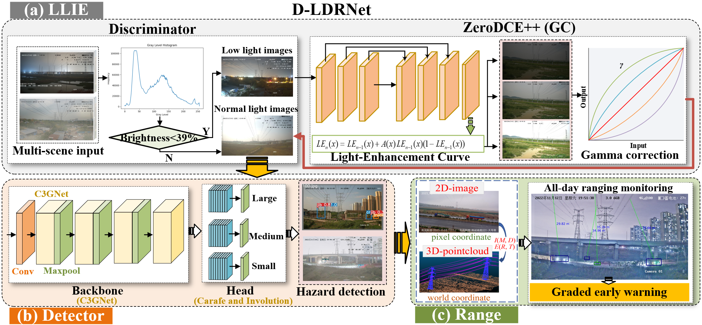

# D-LDRNet
D-LDRNet: Monocular vision framework for all-weather safe ranging monitoring of vehicle in transmission lines
# Datasets
This open access dataset and official code is publicly available for our paper work "D-LDRNet: Monocular vision framework for all-weather safe ranging monitoring of vehicle in transmission lines". 

<p align="center">

</figure> 
</p>

## Abstract
Efficient monitoring and early warning of hazards on transmission lines are crucial for the safety of both the lines themselves and the surrounding personnel. Among them, the monitoring for the real-time distance of construction machinery and other vehicles approaching power lines is an effective and cost-efficient method of hazard detection. This paper proposes a novel architecture named D-LDRNet for all-weather distance monitoring based on monocular vision, which can obtain three-dimensional information of hazardous objects using only a monocular camera. Firstly, an innovative feature extraction network is constructed to reduce redundant convolutional calculations and parameters, coupled with new upsampling operators and optimized detection head networks using Involution. Then, an improved low-light enhancement network is introduced to enhance the recognition performance of the detection model in nighttime scenarios. Finally, leveraging the pose matching relationship between images and point clouds, a ranging module for hazardous objects is designed and integrated into the constructed hazard detector. Experimental results conducted on surveillance images from different transmission line scenarios demonstrate that D-LDRNet not only possesses a more lightweight network structure but also exhibits optimal hazard detection performance in nighttime construction scenes. Experiments conducted on surveillance videos further confirm the effectiveness of the proposed ranging scheme and its industrial application significance.

<p align="center">

</figure> 
</p>

## WSBEV datasets link
The sample dataset has been released at [Google Drive](https://drive.google.com/file/d/1cAqs7MFdctqjx4AtJC9saqGUEy72MaC2/view?usp=sharing).

As the WSBEV dataset is supported by ORCA-Uboat company, we only expect that the WSBEV dataset is utilized in academic research but commercial usage. Therefore, a research qualification verification is needed in dataset request stage. Full dataset request can be directly obtained through an email qualification verification (xhu@orca-tech.com.cn). 


## How to use WSBEV datasets
Our recording platform is a commercial autonomous surface vehicle. The platform adopts a deployable sensor configuration and is equipped with four surrounding cameras, a front-view LiDAR, six surrounding millimeter-wave radars, and an inertial navigation system (INS). The sensor setup of our platform is also illustrated in Figure. 2. The LiDAR and MMW radar systems provide accurate location measurements for the surrounding water surface system. With respect to camera configuration, we equipped 120° pinhole RGB cameras on the front view and back view of our recording platform, and each side of the boat is equipped with a fisheye camera for a high field of view. The detailed information about WSBEV dataset is described as follows:

### Data structure

```
- Scene 1
  - ImageSets
      - test.txt
      - val.txt
      - train.txt

  - JPEGImages
    - front_images
        - seq1_00001.jpg
        - seq1_00002.jpg
    - back_images
        - seq1_00001.jpg
        - seq1_00002.jpg
    - left_images
        - seq1_00001.jpg
        - seq1_00002.jpg
    - right_images
        - seq1_00001.jpg
        - seq1_00002.jpg

  - Imu_data
    - seq1_00001.txt
    - seq1_00002.txt

  - Ground_truth
    - seq1_00001.png
    - seq1_00002.png
  
  - Sensor_calibration
    - front.json 
    - back.json
    - left.json
    - right.json

- Scene 2
    - ImageSets
    - JPEGImages
    - Imu_data
    - Ground_truth
    - Sensor_calibration

- Scene N
```

### Ground truth labels
| Code | Label      | Note                                               |
|------|------------|----------------------------------------------------|
| 0    | shore      | Static object                                      |
| 1    | water      | Drivable area                                      |
| 2    | boat       | Surface vehicles                                   |
| 3    | wharf      | Return docking area                                |
| 4    | bridge     | GPS denied area                                    |

### Imu_data
| Column                | Description                            |
|-----------------------|----------------------------------------|
| pitch                 | pitch (x-axis, right)                  |
| roll                  | roll (y-axis, front)                   |


# Hybrid-BEV
To address the limitations of existing visual BEV perception methods against the challenges of water surface scenes and improve the deployment of visual BEV models for hybrid-type camera inputs, we propose a novel hybrid water surface BEV method named Hybrid-BEV. We put the model design code at ./model foloder, full training code is being organized. The model architecture is shown as follow:

<p align="center">

</figure> 
</p>

## Visualization Samples
<p align="center">

</figure> 
</p>


## Acknowledgement
We use some codes from [LSS](https://github.com/nv-tlabs/lift-splat-shoot.git)[1], [SimpleBEV](https://github.com/aharley/simple_bev)[2], [Bevformer](https://github.com/fundamentalvision/BEVFormer)[3]. A big thanks to their great work!

[1] Philion J, Fidler S. Lift, splat, shoot: Encoding images from arbitrary camera rigs by implicitly unprojecting to 3d[C]//Computer Vision–ECCV 2020: 16th European Conference, Glasgow, UK, August 23–28, 2020, Proceedings, Part XIV 16. Springer International Publishing, 2020: 194-210.


[2] Harley A W, Fang Z, Li J, et al. Simple-bev: What really matters for multi-sensor bev perception?[C]//2023 IEEE International Conference on Robotics and Automation (ICRA). IEEE, 2023: 2759-2765.

[3] Li Z, Wang W, Li H, et al. Bevformer: Learning bird’s-eye-view representation from multi-camera images via spatiotemporal transformers[C]//European conference on computer vision. Cham: Springer Nature Switzerland, 2022: 1-18.
