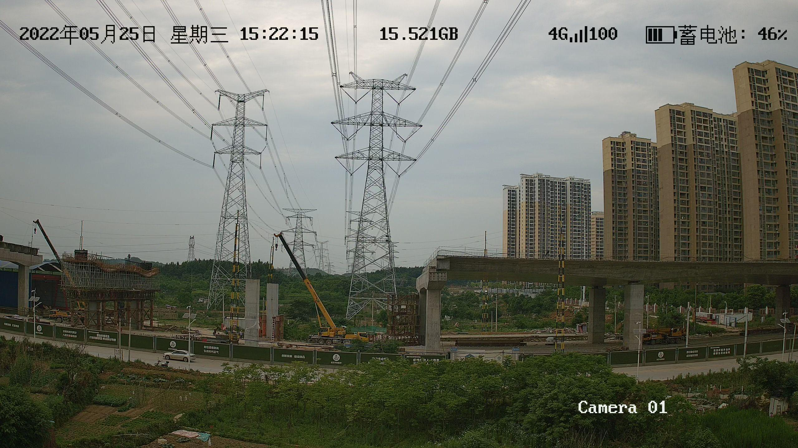

# D-LDRNet
This open access dataset and official code is publicly available for our paper work "D-LDRNet: Monocular vision framework for all-weather safe ranging monitoring of vehicle in transmission lines". 

## Abstract
Efficient monitoring and early warning of hazards on transmission lines are crucial for the safety of both the lines themselves and the surrounding personnel. Among them, the monitoring for the real-time distance of construction machinery and other vehicles approaching power lines is an effective and cost-efficient method of hazard detection. This paper proposes a novel architecture named D-LDRNet for all-weather distance monitoring based on monocular vision, which can obtain three-dimensional information of hazardous objects using only a monocular camera. Firstly, an innovative feature extraction network is constructed to reduce redundant convolutional calculations and parameters, coupled with new upsampling operators and optimized detection head networks using Involution. Then, an improved low-light enhancement network is introduced to enhance the recognition performance of the detection model in nighttime scenarios. Finally, leveraging the pose matching relationship between images and point clouds, a ranging module for hazardous objects is designed and integrated into the constructed hazard detector. Experimental results conducted on surveillance images from different transmission line scenarios demonstrate that D-LDRNet not only possesses a more lightweight network structure but also exhibits optimal hazard detection performance in nighttime construction scenes. Experiments conducted on surveillance videos further confirm the effectiveness of the proposed ranging scheme and its industrial application significance.

<p align="center">

</figure> 
</p>

## Methodology
The model architecture is shown as follow:

<p align="center">

</figure> 
</p>

## datasets
We designs an all-weather detection and ranging framework that incorporates low-light enhancement for safety monitoring of vehicles in transmission lines. As an end-to-end method, it can obtain three-dimensional information of hazardous objects using only a monocular camera. The detailed information about dataset is described as follows:

### Data structure

```
- datasets
  - train
      - images
        - XXX.jpg
      - labels
        - XXX.txt
  - val
      - images
        - XXX.jpg
      - labels
        - XXX.txt
  - test
      - XXX.jpg
  - point cloud
```

## Samples
<p align="center">

</figure> 
</p>

<p align="center">

</figure> 
</p>
